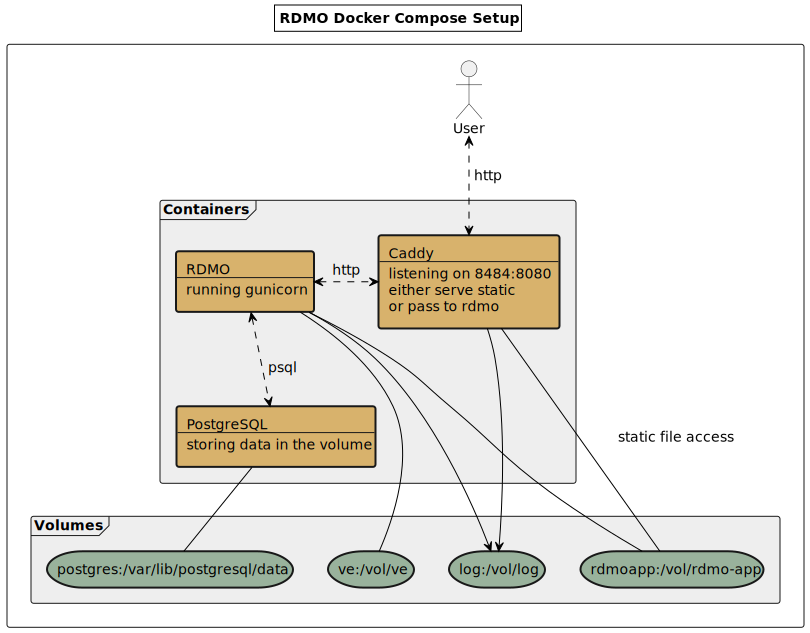

# RDMO Docker Compose 

<!--- mdtoc: toc begin -->

1. [Synopsis](#synopsis)
2. [Structure](#structure)
   1. [Dockers](#dockers)
   2. [Volumes](#volumes)
3. [Configuration & Usage](#configuration---usage)
4. [Multiple RDMO Instances on a Single Docker Host](#multiple-rdmo-instances-on-a-single-docker-host)<!--- mdtoc: toc end -->

## Synopsis

This repository contains RDMO docker images that are held together by [docker compose](https://github.com/docker/compose/releases) which obviously is required to make use of it. If not configured differently the built RDMO instance should be available at `localhost:8484`. Please see below how setting can be changed.

## Structure

### Dockers

Three containers are going to be created running `Caddy`, `PostgreSQL` and `RDMO`.

### Volumes

During build four folders later used as volumes will be created under `vol/`. They contain the following:

1. `log` log files
2. `postgres` database
3. `rdmo-app` rdmo app installation

Note that the `vol` folder is mounted as a single volume. This provides additional flexibility because any folder created inside `vol` will be available inside the `caddy` and the `rdmo` container and may be used to transfer data between the docker host and these two containers.



## Configuration & Usage
1. Declare your settings in `variables.local`

   Default settings are stored in the `variables.env`. You may want to change things to adjust RDMO to your local needs. As `variables.env` is part of the repo and would get overwritten if you pulled again the `makefile` contains a logic that lets you use a file called `variables.local` instead. If such a file exists the settings will be loaded from there. Simply copy `variables.env` to `variables.local` and feel free to change whatever you want.

   Please note that you might need to change the `ALLOWED_HOSTS` entry depending on your server setup. The URL or IP under which RDMO is served needs to be allowed by putting it into the list. Usually the allowed hosts are declared in the `local.py`. In this docker compose setup we decided to move it into the environment variables and so the `variables.env` to raise awareness that the setting might need to be adjusted.

   It is possible to change the restart policy of all three Docker services via changing the `RESTART_POLICY` variable.

2. Build by running `make`

3. Maybe create an RDMO user

   Note that we decided not to automatically create any user account for the freshly created RDMO instance. You may want to do this manually.

   ```shell
   # connect to the docker
   docker exec -ti rdc-rdmo bash

   # do either
   python manage.py createsuperuser
   # or
   python manage.py create_admin_user
   ```

4. Import data from rdmo-catalog

   A fresh RDMO installation does not contain any data. You may want to import `conditions`, `domains`, `options`, `questions`, `tasks` and `views`. In the `RDMO container` there is a shell script that automatically clones the [rdmo-catalog repo](https://github.com/rdmorganiser/rdmo-catalog) and imports everything in it. If you consider it being helpful you could do `import-github-catalogues.sh`.

## Multiple RDMO Instances on a Single Docker Host

You can have multiple running RDMO instances on a single docker host as long as you pay attention to three things.

1. Use different folders containing the `rdmo-docker-compose` repo to make sure docker-compose considers your build attempts to be different projects. Unfortunately currently there is no manual configuration for this because the `COMPOSE_PROJECT_NAME` option seems to be broken.
2. Make sure to use different `GLOBAL_PREFIX` settings in your `variables.local` to avoid conflicts between your docker containers and volumes.
3. And obviously change the `FINALLY_EXPOSED_PORT` settings to make sure to use a free port to expose RDMO.
